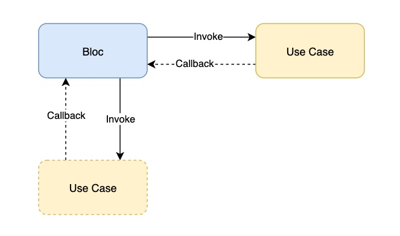

summary: Clean - The Bloc and Use Case
id: clean_bloc_and_use_case
categories: flutter
tags: Clean, Bloc, Use Case, Flutter, Service
status:  Active
authors: Eric Narvaez

# Clean - The BLoC and Use Case

## Definition
- BLoC - Business Logic Component (BLoC), the core of the feature. 
A bloc should be placed under bloc folder and named with suffix **_bloc.dart**. 

- Use Case - A specific use case of the feature.
A use case should be placed under bloc folder and named with suffix **_usecase.dart**.

## BLoC
Business Logic Component (BLoC), the core of the feature. 
- A bloc should be placed under bloc folder and named with suffix **_bloc.dart**. 
- A bloc should extend from **Bloc**(a class defined by clean_framework).
- A bloc can have multiple **Pipe**(a class defined by clean_framework, a wrapper of StreamController).
- A bloc can have multiple **UseCase**(a class defined by clean_framework).
- All pipes must be disposed in dispose function of the bloc.

        class DemoBloc extends Bloc {
            final viewModelPipe = Pipe<DemoViewModel>();

            late DemoUseCase _demoUseCase;

            DemoBloc({DemoUseCase? demoUseCase}) {
                _demoUseCase = demoUseCase ??
                    DemoUseCase(
                    fetchDataCallback: (viewmodel) {
                        return viewModelPipe.send(viewmodel);
                    },
                    );
                _demoUseCase.fetchData();
            }

            @override
            void dispose() {
                viewModelPipe.dispose();
            }
        }

## Use Case
A specific use case of the feature.
- A use case should be placed under bloc folder and named with suffix **_usecase.dart**.
- A use case should extend from **UseCase**(a class defined by clean_framework).
- A use case can have multiple **ViewModelCallback**(a type defined by clean_framework with a generic ViewModel type).
- Create specific methods to handle specific logic.
- All results must be push back to bloc via callback.

        class DemoUseCase extends UseCase {
            ViewModelCallback<DemoViewModel>? fetchDataCallback;
            DemoUseCase({this.fetchDataCallback});
            void fetchData() {
                if (fetchDataCallback != null) {
                fetchDataCallback!(DemoViewModel());
                }
            }
        }

## Relationship
A bloc can have multiple use cases. **BLoC** is the owner & invoker of the **Use Case**.

## Responsibility
- Bloc - Listen events/data from presenter via pipes, and invoke the use case by specific business logic. Receive updated viewmodel from UseCase via callback, and send the viewmodel to presenter via pipe.
- Use Case - Collaborate with Repository and ServiceAdapter, send updated viewmodel to the bloc via callback. 

## How to test
We use [mockito](https://pub.dev/packages/mockito) to mock our unit tests. The key rule is mock everything except the one you want to test/verify. 

- Bloc test, you need to mock all UseCases and put them into the bloc constructor. Then trigger the target method by invoke or launch the pipe. And verify if you can got the correct data/viewmodel.

        test('Demo bloc test', () async {
            final mockedUseCase = MockUseCase();
            final bloc = Demobloc(demoUseCase: mockedUseCase);
            bloc.viewModelPipe.receive.listen(expectAsync((viewModel) {
                expect(viewModel, mockedUseCase.viewModel);
            }));
        });

- UseCase test, you need to mock all callbacks and put them into the use case constructor. Then invoke the target method. And verify if the certained callback was called.

        test('Demo use case test', () async {
            final mockedCallback = MockCallback();
            final usecase = DemoUseCase(fetchDataCallback: mockedCallback);
            usecase.fetchData();
            verify(mockedCallback(any)).called(1);
        });
