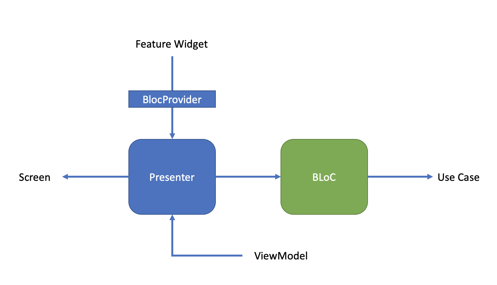
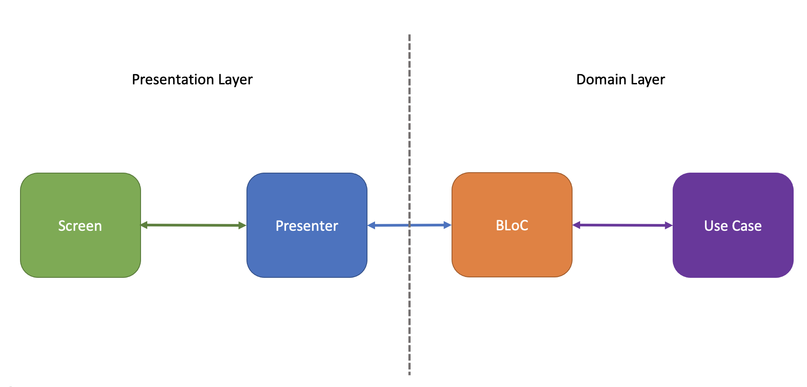

summary: Clean - Presenter and Bloc
id: clean_presenter_bloc
categories: Mobile Development with Flutter
tags: Clean Framework, Flutter, Clean Architecture
status:  Active
authors: Alireza Khakpour

<style>
r { color: Red }
o { color: Orange }
g { color: Green }
</style>

# Clean - The Presenter and BLoC
 
## Introduction



- **Presenter** : Creates Screen based on `BuildContext`, `BLoC`, and `ViewModel`, and support screen action.
- **BLoC** : The Bloc component, manage state across the app and routes data to other parts of the Framework.

## Presenter

**Presenter** should extent `Presenter< Bloc, ViewModel, Screen>` to create the Screen, Loading Screen, Error Screen, and also presenter manages all user actions on screen.

```dart
    class ExamplePresenter extends Presenter<ExampleBloc, ExampleViewModel, ExampleScreen>  {     
      
        @override
        ExampleScreen buildScreen(BuildContext context, ExampleBloc  bloc, ExampleViewModel viewModel) {...    

        @override
        Stream<DepositCheckCardViewModel> getViewModelStream (ExampleBloc bloc) {...

        @override
        Widget buildLoadingScreen(BuildContext context) {...

        @override
        Widget buildErrorScreen(BuildContext context, Object? error) {...
    }
```

 * `getViewModelStream` method handles all changes related to `ViewModel` by `BLoc` listener.
* `buildLoadingScreen` method return a `Widget` to create the loading screen.
* `buildErrorScreen` method return a `Widget` to create the error screen.
* `buildScreen` method return a `Screen` to create the UI by passing the associated `ViewModel` and also the action functions.

```dart
      @override
      ExampleScreen buildScreen(BuildContext   context,
          ExampleBloc bloc, ExampleViewModel  viewModel) {
        return ExampleScreen(
          viewModel: viewModel,
          pressenterActions: ExamplePressenterActions(),
        );
      }
```

## BLoC


- Business Logic Component (BLoC), is like an application traffic manager.

- The Bloc connect Usecase and UI via pipes


```
class ExampleBloc extends Bloc {
	ExampleUseCase? _exampleUseCase;

	final exampleViewModelPipe = Pipe<ExampleViewModel>();
	final exampleEventPipe = Pipe<ExampleEvent>(canSendDuplicateData: true);

	@override
	void dispose() {
		exampleViewModelPipe.dispose();
		exampleEventPipe.dispose();
	}
	
	ExampleBloc({ExampleUseCase? exampleUseCase}) {
		_exampleUseCase = exampleUseCase ?? ExampleUseCase(exampleEventPipe.send);
		exampleViewModelPipe.whenListenedDo(() => _exampleUseCase!.execute());
		exampleEventPipe.receive.listen(exampleEventPipeHandler);
	}
	void exampleEventPipeHandler(ExampleEvent event) {}
}

```

## Relationship

Presenter and Bloc are connecting the domain layer and presentation layer, to serve Screen data/state with logic that process in usecase.


## Resposibility

* BLoC manage presenter action or all other types of events happening in Presentation layer through event pipe connect to use case. 
* Presenter could access to stream on view model through BLoC view model pipes that connect to use case view model callback. 
Bloc - Listen events/data from presenter via pipes, and invoke the use case by specific business logic. Receive updated viewmodel from UseCase via callback, and send the viewmodel to presenter via pipe.
Use Case - Collaborate with Repository and ServiceAdapter, send updated viewmodel to the bloc via callback.


