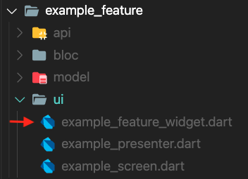

summary: Clean - The Screen and Presenter
id: clean_screen_presenter
categories: Mobile Development with Flutter
tags: Scerrn, UI, Presenter, Test, Widget Test
status:  Active
authors: Alireza Khakpour

<style>
r { color: Red }
o { color: Orange }
g { color: Green }
</style>

# Clean - The Screen and Presenter

## Introduction


- **Feature Widget** : Creates `BLoC` and associated a Presenter to the `BLoC`
- **Presenter** : Creates Screen based on `BuildContext`, `BLoC`, and `ViewModel`
- **Screen** : The actual UI widget being present for the specific Use Case and This is where the view model will map the data to the UI


## Feature Widget




**Feature Widget**
: is a `StatelessWidget` that describes the feature user interface by initializing the BLoc and associate a presenter to the `BLoC`.

><g> To implement a feature we should initialize the feature widget through a route path or in a hub list.

```dart
    class ExampleWidget extends StatelessWidget {
      @override
      Widget build(BuildContext context) {
        return BlocProvider<ExampleBloc>(
          create: (_) => ExampleBloc(),
          child: ExamplePresenter(),
        );
      }
    }
```

## Presenter


**Presenter** creates three different state of the screen such as Loading Screen, Error Screen and Screen, also manages all screen actions


```dart
    class ExamplePresenter extends Presenter<ExampleBloc, ExampleViewModel, ExampleScreen>  {     
      
        @override
        ExampleScreen buildScreen(BuildContext context, ExampleBloc  bloc, ExampleViewModel viewModel) {...    

        @override
        Stream<DepositCheckCardViewModel> getViewModelStream (ExampleBloc bloc) {...

        @override
        Widget buildLoadingScreen(BuildContext context) {...

        @override
        Widget buildErrorScreen(BuildContext context, Object? error) {...
    }
```


 `getViewModelStream` Method
  : `BLoc` listener handle view model changes 

  `buildLoadingScreen` Method
  : Creat the loading screen 

  `buildErrorScreen` Method
  : Creat error screen 

  `buildScreen` Method
  : Creat the screen by passing associated `viewModel` 

```dart
      @override
      DepositCheckCardScreen buildScreen(BuildContext   context,
          ExampleBloc bloc, ExampleViewModel  viewModel) {
        return ExampleScreen(
          viewModel: viewModel,
          pressenterActions: ExamplePressenterActions(),
        );
      }
```
All screen action could handle in a separated action class

```dart
    class ExamplePressenterActions {
      
      DepositCheckCardPressenterActions();

      navigateToDetail(BuildContext context) {
        CFRouterScope.of(context).push(Router.detailRoute);
      }
    }
```

## Screen


Screen or UI widget presents the specific Use Case base on `ViewModel`. 

> <g> All action on the screen should handle through presenterAction

```dart
    class ExampleScreen extends Screen {
        final ExampleViewModel viewModel;
        final ExamplePressenterActions pressenterActions;

        ExampleScreen(
          {required this.viewModel, required this.pressenterActions});

        @override
        Widget build(BuildContext context) {...

    }
```

## How To Test UI

1. Add the flutter_test dependency.
2. Create a widget to test.
3. Create a `testWidgets` test.
4. Build the widget using the `WidgetTester`.
5. Search for the widget using a `Finder`.
6. Verify the widget using a `Matcher`.


## Widget Test

 The purpose of this test is to ensure every interaction the user makes produces the expected result.


Most common finder method:

  - `find.byKey()` : Finds widgets by searching for one with a particular [Key].
  - `find.byType()` : Finds widgets by searching for widgets with a particular type.
  - `find.text()` : Finds [Text] and [EditableText] widgets containing string equal to the text argument.  
    
Testing TextField:

- `tester.enterText(Finder finder, String text)` : Give the text input widget specified by [finder] the focus and enter [text] as if it been provided by the onscreen keyboard.

Testing Button Action:

- `tester.tap(Finder finder)` : Dispatch a pointer down / pointer up sequence at the center of the given widget, assuming it is exposed.

## Sample Screen Test 

- Test should verify back button action on the screen
  
 1. create a `MockPressenterAction` to cover presenter actions 

```dart
    class MockPressenterAction extends Mock implements ExamplePressenterActions {}
```

 2. create a `ExampleViewModel` and pass to screen 

 3. create a `MaterialApp` object 

```dart
    MaterialApp testWidget = MaterialApp(
      home: ExampleScreen(
          viewModel: exampleViewModel,
          pressenterAction: mockPressenterAction),
    );
```

 4. `pumpWidget` calls runApp, and also triggers a frame to paint the app.
 
 ```
    await tester.pumpWidget(testWidget);
 ```

 3. Find back button

```
    final finder = find.byKey(Key('Back-Button'));;
```

 4. Tap on back button

```
    await tester.tap(finder);
```

 5. Verify that a method on a mock object was called with the given arguments.

```
verify(mockPressenterAction.popNavigationListener(any)).called(1);
```


## Sample Presenter Test

- Test should pass the appearance of the presenter

 1. create a `MaterialApp` object 

 ```dart
    MaterialApp testWidget = MaterialApp(
      home: BlocProvider<ExampleBlockMock>(
        create: (_) => ExampleBlockMock(),
        child: ExamplePresenter(),
      ),
    );
 ```

 2. pumpWidget calls runApp, and also triggers a frame to paint the app.
 
 ```
    await tester.pumpWidget(testWidget);
 ```

 3. Find `ExamplePresenter` widget

 ```
    final finder = find.byType(ExamplePresenter);
 ```

 4. Expect to find one widget

 ```
    expect(finder, findsOneWidget);
 ```
